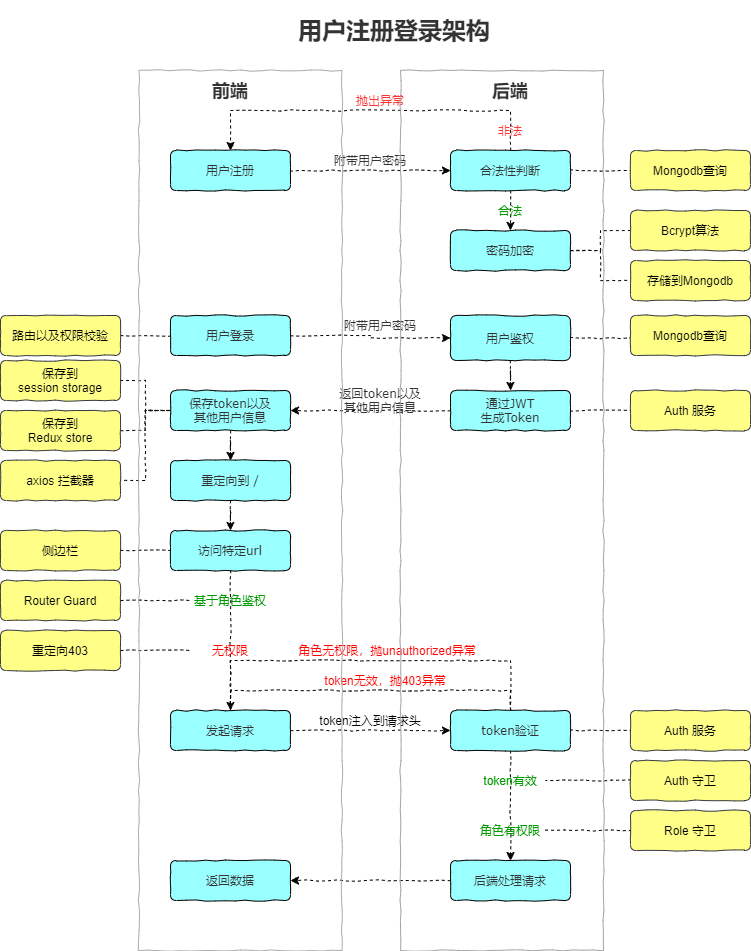

# 01 - 由用户登录而来的 JWT 鉴权，权限管理

## 前言

> 当一个新手学习 React 想要找一个练手的项目，结果市面上开源的都是各种 TODO App，甚至于 Real World 系列也差强人意。付费课程大多也很难详尽地讲清楚方方面面。同时，Admin, dashboard 之类的中后台的需求日愈旺盛，值得前端开发者多多关注。于是就有了[React Nest Admin](https://github.com/cnscorpions/React-Nest-Admin)的产生，本文是其系列文章**手把手带你撸一个前后端分离的 Admin 项目**的开篇文章

## 谁适合食用?

- 想要掌握 JWT 鉴权，权限管理（前后端）
- 想了解真实项目上线
- 不适合全栈

## 步骤

### 技术栈

本项目前端基于 CRA 搭建，技术栈涉及 es6+, react, react-router, react-redux（以及 redux-devTools, redux-thunk, react-persist 等中间件），axios 和 ant design of react，sass, CSS Module 等等，后端基于 nest-cli 搭建，技术栈涉及 Typescript, nest.js 及其中间件，mongodb, mongoose, rxjs 等等，运维涉及 MEAN 环境搭建（涉及到 Nginx 的偏多），PM2 部署 node 应用。

### 为什么不用 antd pro

- 不喜欢 antd pro + umi + dva 的绑定（尽管它们很优秀）
- antd pro 内容太多，初学者拿来学习中后台开发难以找到头绪
- 从零打造一个 admin 系统，一点点优化处来，有成就感，也顺手一些

### 为什么使用 Nest.js

- 全面支持 Typescript
- 基于 Express.js，方便使用其丰富的中间件生态
- 受 Angular 启发的**架构**
  > while plenty of superb libraries, helpers, and tools exist for Node (and server-side JavaScript), none of them effectively solve the main problem of - Architecture. Nest provides an out-of-the-box application architecture which allows developers and teams to create highly testable, scalable, loosely coupled, and easily maintainable applications - **By Nest.js Official**

### 一分钟了解 Nest.js 核心概念

熟悉 Angular 的朋友看下 Nest.js 官方的 Overview 就可以愉快地 CRUD 了，不熟悉的朋友了解一下几点就可以了：

- 通过模块树来组织应用结构
  
- controller, module, service 是 Nest 三剑客，是基础要素，controller 负责处理入站请求，返回相应到客户端，module 实现某功能封装，把业务逻辑放到 service 里进行处理，service 可以通过依赖注入到 controller 和其他 service 中去
- Express.js 是一个基于 middleware 的中间件，所以 Nest 也是。像 Guards, Filters, Interceptors 等等实际上都是 middleware，只是具有不用功能，且执行顺序不同
  

> 学习 Nest Tips:<br/>
>
> 1. 反复阅读[Nest 官方文档](https://docs.nestjs.com)，因为它的资料不算多
> 2. 代码示例可以参考[Nest Sample](https://github.com/nestjs/nest/tree/master/sample)，搭配 Octotree 食用更佳，非常全面
> 3. 遇到问题，可以依照 stackoverflow --> issues 区 ---> Nest Discord 服务器，寻找解决办法

### 步骤

1. 前后端项目初始化

```
# 强烈建议换源头，同时安装nrm方便切换registry
# 建议安装nvm，实现多版本node安装

# 通过cra脚手架安装
npx create-react-app admin-fe

# 安装nest li
npm i -g @nestjs/cli

# 创建新的项目
nest new admin-be

```

2.

## 用户登录流程图



## 应用上线流程图

## 参考文档

[Nest 官方文档](https://docs.nestjs.com/)
